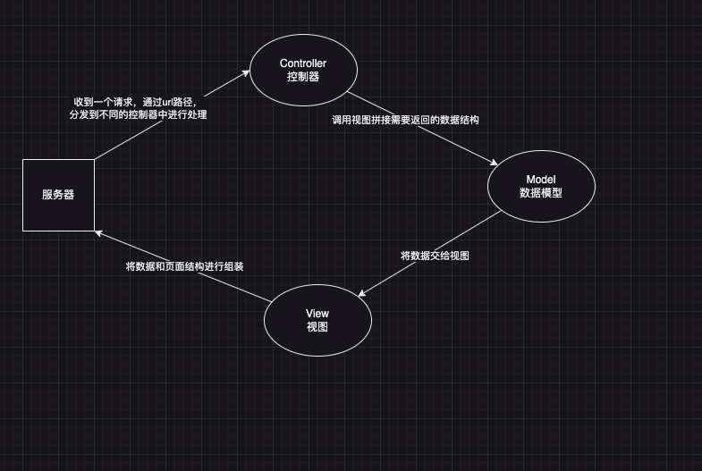
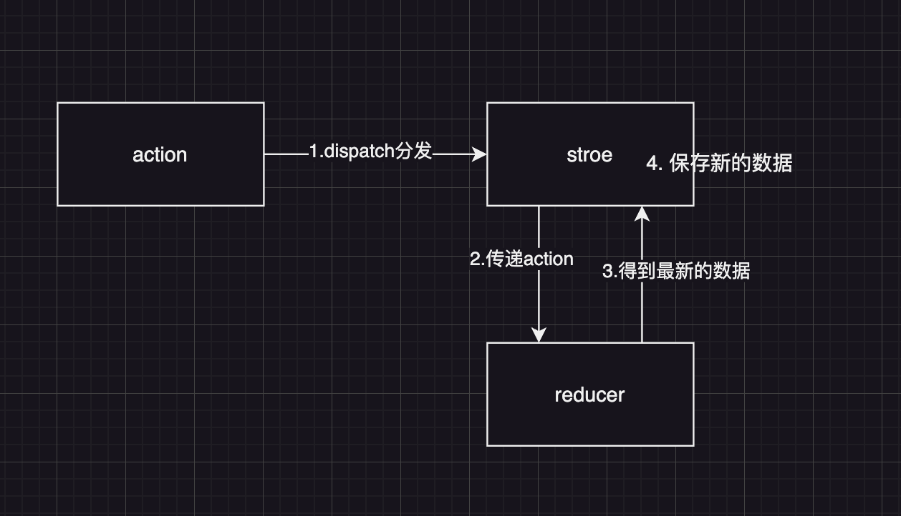

# Redux核心概念
**action reducer store**

## MVC
服务器端的MVC
**Controller**: 处理请求，组装这次请求需要的数据（model）
**Model**：需要用于UI渲染的数据模型
**View**: 将数据模型渲染成页面结构



## 前端MVC的困难
1. 前端的controller要比服务端复杂得多，前端的controller处理的是用户的操作，而用户的操作是复杂的。
2. 对于那些前端框架（Vue，React），他们使用了单项数据流，若需要数据共享，则需要将数据提升到最顶层，一层层传递，极其繁琐。虽然可以使用上下文context解决，但是对数据的操作难易监控。容易产生调试错误的困难。若是开发中大型项目，共享数据会很多，会导致上下文中的数据更加复杂。

**因此前端急需一个独立的复杂数据解决方案**

## Flux
Flux提出的数据解决方案，最大的意义在于它引入了Action的概念
action是一个普通的对象，用于描述“要干什么？”。**action是触发数据变化的唯一原因**
store表示数据仓库，用于存储共享数据。还可以更具不同的action更改仓库中的数据。
eg: 
```js
{
    type: 'login',
    payload: {
      username: '张三',
      password: 123456
    }
}
```
## Redux
在Flux的基础上，引入了reducer的概念
reducer: 处理器，根据action来处理数据，处理后的数据会被数据仓库保存。
